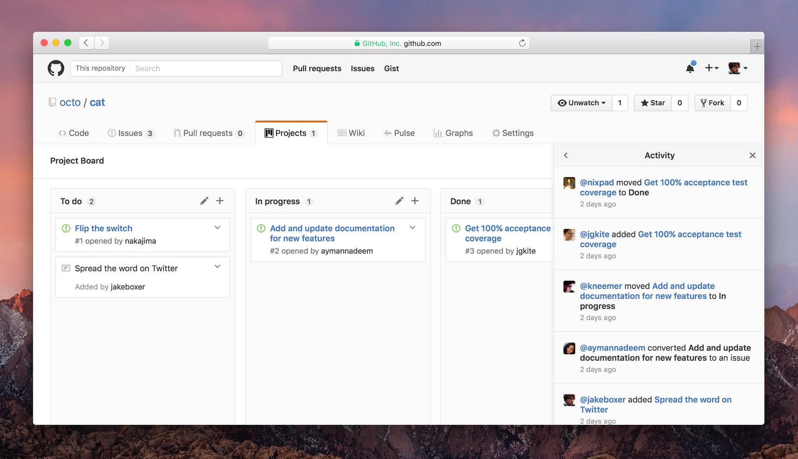

# Reto 2
## Identifica los elementos de navegación en los siguientes sites
pagina web escojida: Github

## Navegación

Global:
Local:
Facetada:
Filtrada:
Contextual:
En línea (inline):
Suplementaria:
